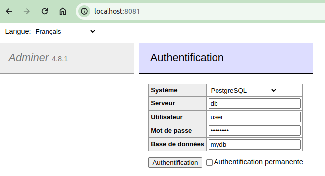

# Database

Pour que notre back serve à quelque chose, nous allons ajouter une base de données Pgsql. Modifions le docker compose pour ajouter ce service :

```yaml
services:
  front:
    image: nginx
    ports:
      - "8080:80"
    volumes:
      - ./front:/usr/share/nginx/html

  back:
    build: ./back
    ports:
      - "3000:3000"
    command: node index.js
    depends_on:
      - db

  db:
    image: postgres:13
    environment:
      POSTGRES_USER: user
      POSTGRES_PASSWORD: password
      POSTGRES_DB: mydb
```

- `depends_on` : permet de spécifier l'ordre de démarrage des services
- `environment` : variables d'environnement pour la base de données
  - `POSTGRES_USER` : nom d'utilisateur
  - `POSTGRES_PASSWORD` : mot de passe
  - `POSTGRES_DB` : nom de la base de données

Un conteneur `db` va démarrer une base de données Pgsql avec les paramètres spécifiés. Le service `back` dépend du service `db`, donc le service `db` sera démarré avant le service `back`.

Relancez les services :

```bash
docker compose up -d
```

Vous pouvez nous croire sur parole, ou bien nous pouvons vérifier que la base de données existe. Pour cela, nous allons ajouter un service `adminer` pour visualiser la base de données :

```yaml
services:
  front:
    image: nginx
    ports:
      - "8080:80"
    volumes:
      - ./front:/usr/share/nginx/html

  back:
    build: ./back
    ports:
      - "3000:3000"
    command: node index.js
    depends_on:
      - db

  db:
    image: postgres:13
    environment:
      POSTGRES_USER: user
      POSTGRES_PASSWORD: password
      POSTGRES_DB: mydb

  adminer:
    image: adminer
    ports:
      - "8081:8080"
```

Relancez les services puis aller sur `http://localhost:8081` pour voir l'interface d'adminer. Les identifiants sont ceux spécifiés dans le docker compose.



Dans le champ `Server`, renseignez `db` pour le nom du serveur. Docker compose crée un réseau privé pour les services, donc le nom du service `db` est accessible depuis les autres services, comme pour une résolution de nom DNS. On y reviendra plus tard ;)

## Préremplir la base de données

Pour préremplir la base de données, nous allons ajouter un fichier `init.sql` à la racine de notre projet avec le contenu suivant :

```sql
CREATE TABLE users (
  id SERIAL PRIMARY KEY,
  name VARCHAR(255) NOT NULL
);

INSERT INTO users (name) VALUES ('Alice');
INSERT INTO users (name) VALUES ('Bob');
```

Modifions le docker compose pour exécuter ce fichier lors du démarrage de la base de données :

```yaml
services:
  front:
    image: nginx
    ports:
      - "8080:80"
    volumes:
      - ./front:/usr/share/nginx/html

  back:
    build: ./back
    ports:
      - "3000:3000"
    command: node index.js
    depends_on:
      - db

  db:
    image: postgres:13
    environment:
      POSTGRES_USER: user
      POSTGRES_PASSWORD: password
      POSTGRES_DB: mydb
    volumes:
      - ./init.sql:/docker-entrypoint-initdb.d/init.sql

  adminer:
    image: adminer
    ports:
      - "8081:8080"
```

L'instruction `volumes` permet de monter le fichier `init.sql` dans le conteneur `db`. Le fichier `init.sql` sera exécuté lors du démarrage de la base de données.

Avant de relancer les services, nous devons les éteindre et supprimer les volumes :

```bash
docker compose down
```

Cette action permet de repartir sur une base saine. Relancez les services puis reconnectez-vous à l'interface d'adminer. Vous devriez voir la table `users` avec les données préremplies.

---

[:arrow_left:  Précédent](./back.md) | [Suivant :arrow_right:](./volumes.md)
