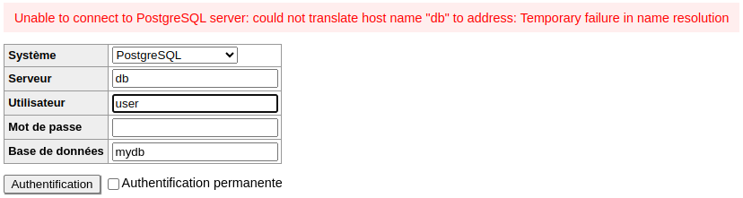

# Réseaux

Les `networks` permettent de connecter plusieurs conteneurs entre eux. Cela permet de communiquer entre les conteneurs sans exposer les ports sur le réseau de l'hôte.

Par défaut, Compose crée un réseau par projet. Ce réseau est utilisé par défaut pour tous les services du projet. Il est possible de créer des réseaux supplémentaires pour isoler des services.

Par exemple, pour isoler le service `db` du service `front`, il est possible de créer un réseau spécifique pour le service `db`, pour ensuite le partager avec le service `back`.

```yaml
services:
  db:
    image: postgres:13
    environment:
      POSTGRES_USER: user
      POSTGRES_PASSWORD: password
      POSTGRES_DB: mydb
    volumes:
      - ./init.sql:/docker-entrypoint-initdb.d/init.sql
      - db-data:/var/lib/postgresql/data
    networks:
      - db-network

  back:
    image: nginx:alpine
    ports:
      - "8080:80"
    networks:
      - db-network

  adminer:
    image: adminer
    ports:
      - "8081:8080"

volumes:
  db-data:

networks:
  db-network:
```

En lançant les services tels quel, le service `db` et le service `back` seront sur le même réseau `db-network`. Le service `adminer` sera sur le réseau par défaut et n'aura pas accès aux données de la base de données.



> Le network isole bien la db des services non nécessaires. Sur une architecture microservices on s'assure qu'aucun service ne puisse accéder à la base de données sans autorisation.

En rajoutant le network `db-network` au service `adminer`, il sera possible de se connecter à la base de données.

```yaml
adminer:
    image: adminer
    ports:
      - "8081:8080"
    networks:
      - db-network
```

---

[:arrow_left: Précédent](./volumes.md) | [Suivant :arrow_right:](./env.md)