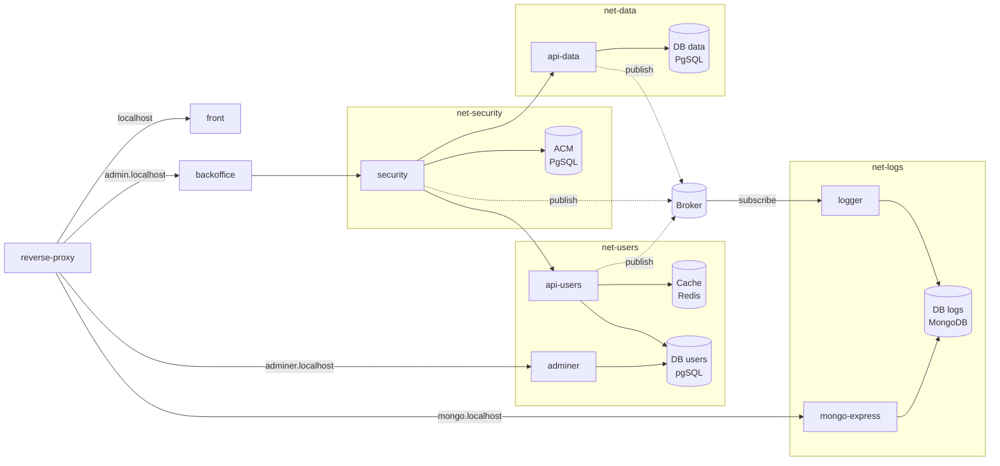

# Atelier Docker

Dans cet exercice, nous allons créer une application microservices complexe à l'aide de Docker. Nous ne ferons pas le code des différents services, mais nous allons les orchestrer et les exécuter dans des conteneurs Docker.

Voici la liste des services que nous allons créer :

- Un reverse-proxy (nginx)
- Un frontend (React + Vite)
- Un backoffice (React + Vite)
- Une API REST pour la gestion des utilisateurs (node.js)
- Une base de données PostgreSQL pour les utilisateurs
- Un service de sécurité pour l'authentification des utilisateurs et les ACL (node.js)
- Une base de données pour l'Access Control Matrix (PostgreSQL)
- Un service de cache pour les données utilisateurs (redis)
- Une API REST pour la gestion des données de l'application (node.js)
- Une base de données PostgreSQL pour les données de l'application
- Un broker de messages pour les logs (Redis)
- Un logger (node.js)
- Une base de données MongoDB pour les logs
- Un Adminer pour la gestion des bases de données PostgreSQL
- Un MongoDB Express pour la gestion de la base de données MongoDB



Les projets node.js seront des applications express.js, avec un Dockerfile multi-stages pour chaque service. Ils peuvent être créés avec [express-generator](https://www.npmjs.com/package/express-generator).

Les projets React + Vite seront des applications React, avec un Dockerfile multi-stage pour chaque service. Ils peuvent être créés avec `npm create vite@latest my-app -- --template react`.

## Reverse proxy

Le reverse proxy est un serveur nginx qui va rediriger les requêtes vers les différents services en fonction de l'URL. Voici la configuration utilisable pour l'application :

```nginx
events {}

http {
    # Permet de prendre en compte le hmr (ws) de vite
    upstream vite-frontend {
        server frontend:5173;
    }
    upstream vite-backoffice {
        server backoffice:5173;
    }

    server {
        listen 80;
        server_name localhost;
        location / {
            proxy_pass http://vite-frontend;
            proxy_set_header Upgrade $http_upgrade;
            proxy_set_header Connection "Upgrade";
            proxy_set_header Host $host;
        }
    }

    server {
        listen 80;
        server_name admin.localhost;
        location / {
            proxy_pass http://vite-backoffice;
            proxy_set_header Upgrade $http_upgrade;
            proxy_set_header Connection "Upgrade";
            proxy_set_header Host $host;
        }
    }

    server {
        listen 80;
        server_name adminer.localhost;

        location / {
            proxy_pass http://adminer:8080;
        }
    }

    server {
        listen 80;
        server_name mongo.localhost;

        location / {
            proxy_pass http://mongo-express:8081;
        }
    }
}
```

## Etapes

- [ ] Créer les template des différents services
  - [ ] front
  - [ ] backoffice
  - [ ] api-users
  - [ ] api-data
  - [ ] security
  - [ ] logger
- [ ] Créer les Dockerfile multi-stages pour chaque service. Ils doivent être utilisables en développemement avec la target `dev` et doivent permettre de "build" et "serve" l'application en production.
  - [ ] front
  - [ ] backoffice
  - [ ] api-users
  - [ ] api-data
  - [ ] security
  - [ ] logger
- [ ] Créer le `compose.yml` pour lancer les services
  - [ ] Créer les networks comme sur le schéma
  - [ ] Créer les volumes pour la persistance de données
  - [ ] Créer des fichiers d'environnement
  - [ ] Créer les services avec leurs dépendances et les healthchecks
